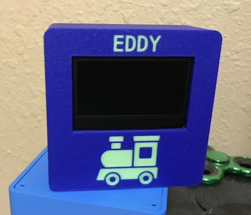

# SleepClock

An alarm clock of sorts for children to show when it is 'go to sleep' or 'wakeup' time.

Built using RP2350, RV3028 RTC, and SSD1309 oled screen.

# Operation

The clock has two time modes that can be set independently. Which mode is active is determined by the current time of day.

* **Go to sleep mode** is a specific time of day where the display dims and a moon picture is shown, indicating it's bedtime. This mode continues until 'wakeup' time.
* **Wakeup mode** is a specific time of day that brightens the display and shows a sun picture indicating it's wakeup time. This mode continues until 'go to sleep' time.

The RV3028 RTC keeps track of the current time of day. The trigger times for special modes are stored in the RV3028's non-volatile user-eeprom.
